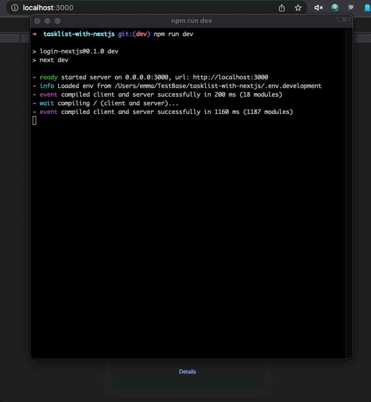

## Task list with nextJs

simple task list with nextJs (js/ts/tsx)

stack information:

- style by emotion css & chakra-ui
- unit test with jest & testing-library
- jwt & bcrypt
- axios
- dayjs for date time utils

specification:

- render task list with lazy load scroll to get content
- swipe to delete task (no call api)
- responsive ui
- auto prefill username (local storage)
- group item from api by createdAt

## Getting Started

- If use nvm please run `nvm use` before (node LTS 18.16.1).
- Install npm package `npm i`
- Start development `npm run dev`
- login with example user (hard code 3 users)
  - Username: test, Password: test
  - Username: testuser2, Password: testuser2
  - Username: testuser3, Password: testuser3

### example run development



### env.example

```
JWT_SECRET_KEY=Yoursecret
JWT_EXPIRE_SEC=86400 // 1 day
```
